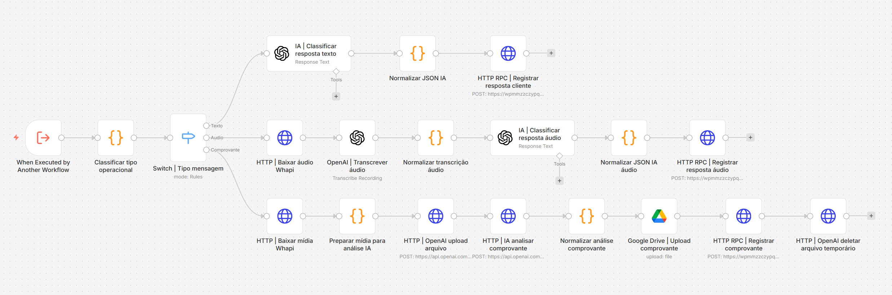
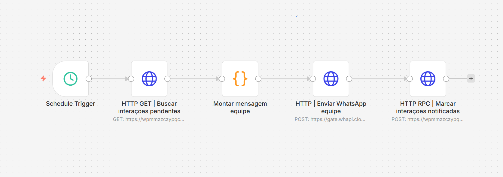

# Automação de Cobrança via WhatsApp com n8n e Supabase

Case técnico de automação financeira com n8n, Supabase, WhatsApp API e IA aplicada de forma controlada para classificação de respostas, transcrição de áudio e apoio na triagem de comprovantes.

> **Nota:** este repositório contém uma versão sanitizada e demonstrativa de uma automação real. Credenciais, URLs internas, IDs operacionais, nomes sensíveis e dados de produção foram removidos ou substituídos por placeholders e dados fictícios.

## Resumo Executivo

Este projeto apresenta uma automação de cobrança via WhatsApp estruturada em quatro workflows n8n e apoiada por uma base operacional no Supabase.

A solução recebe mensagens de clientes, valida se o contato está autorizado, processa respostas em texto/áudio, identifica comprovantes, notifica a equipe financeira e envia cobranças automáticas para contatos elegíveis dentro de janelas de horário controladas.

Na automação original, a base de operação ficava em Google Sheets para facilitar edições manuais como adicionar clientes, remover contatos e registrar novas OSs pendentes. Nesta versão migrada para n8n, o Supabase assume esse papel de base operacional, permitindo mais rastreabilidade e regras transacionais.

Este repositório foca somente na automação, nos workflows n8n e no banco Supabase.

## Destaques Técnicos

- 4 workflows n8n desacoplados por responsabilidade.
- Supabase como fonte de verdade para clientes, pendências, histórico e auditoria.
- Views SQL usadas como filas operacionais de cobrança e notificação.
- RPCs PostgreSQL para registros transacionais e atualização de estados.
- IA usada de forma controlada para classificação, transcrição e triagem de comprovantes.
- Dados reais removidos, com samples fictícios para simulação pública.

## Problema

Operações de cobrança feitas manualmente por WhatsApp costumam sofrer com perda de histórico, envios duplicados, falta de padronização nas mensagens, dificuldade para acompanhar promessas de pagamento e baixa visibilidade sobre comprovantes recebidos.

Quando o volume cresce, a equipe financeira precisa consultar conversas, planilhas e bases operacionais em paralelo, aumentando o risco de erro e reduzindo a rastreabilidade.

## Solução Proposta

A automação centraliza o estado da cobrança no Supabase e usa o n8n como camada de orquestração.

O WhatsApp é tratado como canal de entrada e saída, enquanto o banco concentra as regras de fila, histórico, status, pausa de cobrança, auditoria e comprovantes pendentes de validação humana.

```text
WhatsApp / WHAPI
  -> n8n
    -> Supabase
      -> Operação financeira
```

## Workflows

### 01 - Gateway WHAPI

Recebe o webhook da WHAPI, normaliza o payload, bloqueia mensagens inválidas e verifica se o contato está autorizado para participar da automação.

Documentação: [`docs/08-workflow-01-gateway-whapi.md`](docs/08-workflow-01-gateway-whapi.md)

### 02 - Processar Mensagem

Processa texto, áudio e comprovantes. Usa IA para classificar respostas, transcrever áudio e extrair sinais de comprovantes, registrando tudo no Supabase.

Documentação: [`docs/09-workflow-02-processar-mensagem.md`](docs/09-workflow-02-processar-mensagem.md)

### 03 - Notificar Equipe Entradas

Busca interações pendentes de notificação e envia alertas internos para a equipe financeira.

Documentação: [`docs/10-workflow-03-notificar-equipe-entradas.md`](docs/10-workflow-03-notificar-equipe-entradas.md)

### 04 - Enviar Cobrança Clientes

Busca contatos com pendências elegíveis, monta mensagem por template, envia pelo WhatsApp e registra auditoria do envio.

Documentação: [`docs/11-workflow-04-enviar-cobranca-clientes.md`](docs/11-workflow-04-enviar-cobranca-clientes.md)

## O que este case demonstra

- Decomposição de processo financeiro em workflows desacoplados.
- Uso de Supabase como fonte de estado operacional.
- Migração conceitual de base em planilha para banco relacional.
- Views para filas de cobrança e notificação.
- RPCs para registros transacionais e auditáveis.
- Mensagens automáticas determinísticas por template.
- IA limitada a classificação, extração e transcrição.
- Controle de janela de envio.
- Pausa automática por promessa de pagamento.
- Validação humana antes de marcar pagamento como concluído.
- Sanitização de projeto real para publicação pública.

## Cenários Demonstrados

- Envio automático de cobrança para cliente com uma ou mais pendências vencidas.
- Resposta do cliente com promessa de pagamento e pausa automática da cobrança.
- Recebimento de comprovante e criação de pendência para validação humana.
- Contestação de valor ou serviço, encaminhando a pendência para análise.
- Notificação interna da equipe sobre respostas e comprovantes recebidos.

## Capturas dos Workflows

### Workflow 01 - Gateway WHAPI


### Workflow 02 - Processar Mensagem



### Workflow 03 - Notificar Equipe Entradas



### Workflow 04 - Enviar Cobrança Clientes


## Como Avaliar Rapidamente

1. Leia a visão geral neste README.
2. Abra [`docs/02-arquitetura.md`](docs/02-arquitetura.md) para entender o desenho macro.
3. Abra [`docs/03-workflows-n8n.md`](docs/03-workflows-n8n.md) para ver a função de cada workflow.
4. Abra [`supabase/schema.sql`](supabase/schema.sql) para revisar tabelas, views e RPCs.
5. Abra [`samples/`](samples/) para ver payloads fictícios do fluxo ponta a ponta.

## Stack Utilizada

- **n8n** - orquestração dos workflows.
- **Supabase** - banco de dados, views, funções e RPCs.
- **WHAPI** - integração com WhatsApp.
- **OpenAI** - classificação de respostas, transcrição de áudio e análise auxiliar de comprovantes.
- **Google Drive** - armazenamento de comprovantes recebidos.
- **PostgreSQL/SQL** - modelagem, regras de fila e consultas de auditoria.
- **JSON** - contratos entre APIs, workflows e simulações.

## Arquivos Principais

- [`workflows/sanitizados/`](workflows/sanitizados/) - exports públicos dos workflows n8n.
- [`docs/`](docs/) - documentação técnica do case.
- [`supabase/`](supabase/) - schema demonstrativo, seeds e queries de validação.
- [`samples/`](samples/) - payloads e saídas fictícias para demonstração.
- [`assets/diagramas/`](assets/diagramas/) - diagramas da arquitetura.
- [`assets/screenshots/`](assets/screenshots/) - capturas sanitizadas dos workflows.

## Estrutura do Repositório

```text
.
|-- README.md
|-- .gitignore
|-- assets/
|   |-- diagramas/
|   `-- screenshots/
|-- docs/
|   |-- README.md
|   |-- 00-planejamento.md
|   |-- 01-visao-geral.md
|   |-- 02-arquitetura.md
|   |-- 03-workflows-n8n.md
|   |-- 04-supabase.md
|   |-- 05-simulacao.md
|   |-- 06-privacidade.md
|   |-- 07-checklist-publicacao.md
|   |-- 08-workflow-01-gateway-whapi.md
|   |-- 09-workflow-02-processar-mensagem.md
|   |-- 10-workflow-03-notificar-equipe-entradas.md
|   `-- 11-workflow-04-enviar-cobranca-clientes.md
|-- samples/
|-- supabase/
`-- workflows/
    `-- sanitizados/
```

## Como Navegar no Case

- Para uma leitura rápida, comece por este README.
- Para entender a arquitetura, leia [`docs/02-arquitetura.md`](docs/02-arquitetura.md).
- Para revisar os workflows, leia [`docs/03-workflows-n8n.md`](docs/03-workflows-n8n.md).
- Para entender a camada Supabase, leia [`docs/04-supabase.md`](docs/04-supabase.md).
- Para ver como a demonstração é simulada, leia [`docs/05-simulacao.md`](docs/05-simulacao.md).

## Status

Case preparado para portfólio público.

Itens concluídos:

- estrutura base do repositório;
- exports n8n sanitizados;
- documentação pública;
- prints dos workflows;
- schema Supabase demonstrativo;
- seeds e samples fictícios;
- checagem final de privacidade local.
