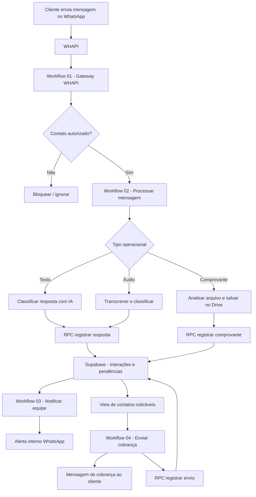

# Arquitetura macro

```mermaid
flowchart TD
  A["Cliente envia mensagem no WhatsApp"] --> B["WHAPI"]
  B --> C["Workflow 01 - Gateway WHAPI"]
  C --> D{"Contato autorizado?"}
  D -- "Não" --> E["Bloquear / ignorar"]
  D -- "Sim" --> F["Workflow 02 - Processar mensagem"]

  F --> G{"Tipo operacional"}
  G -- "Texto" --> H["Classificar resposta com IA"]
  G -- "Áudio" --> I["Transcrever e classificar"]
  G -- "Comprovante" --> J["Analisar arquivo e salvar no Drive"]

  H --> K["RPC registrar resposta"]
  I --> K
  J --> L["RPC registrar comprovante"]

  K --> M["Supabase - interações e pendências"]
  L --> M

  M --> N["Workflow 03 - Notificar equipe"]
  N --> O["Alerta interno WhatsApp"]

  M --> P["View de contatos cobráveis"]
  P --> Q["Workflow 04 - Enviar cobrança"]
  Q --> R["Mensagem de cobrança ao cliente"]
  Q --> S["RPC registrar envio"]
  S --> M
```
