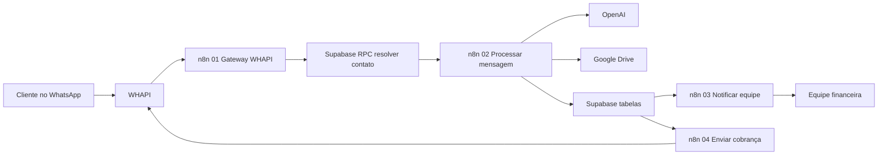

# Arquitetura

## Visão Macro

```text
WHAPI / WhatsApp
  -> n8n
    -> Supabase
      -> Operação financeira
```

## Diagrama

Veja também [`assets/diagramas/arquitetura-macro.md`](../assets/diagramas/arquitetura-macro.md).



## Camadas

### WhatsApp / WHAPI

Canal de entrada e saída das mensagens.

Responsabilidades:

- receber mensagens de clientes;
- entregar webhook ao n8n;
- enviar mensagens automáticas ou alertas internos.

### n8n

Camada de orquestração.

Responsabilidades:

- normalizar payloads;
- chamar APIs externas;
- direcionar branches;
- montar mensagens;
- chamar RPCs do Supabase;
- executar schedules.

### Supabase

Fonte de estado e auditoria.

Responsabilidades:

- armazenar clientes, contatos e pendências;
- manter histórico de interações;
- controlar comprovantes;
- expor views de fila;
- executar RPCs transacionais.

### Operação Financeira

Camada humana e administrativa, representada pela operação sobre a base de cobrança e pelas validações financeiras que exigem decisão humana.

Responsabilidades:

- revisar comprovantes;
- pausar ou retomar cobranças;
- marcar pagamento/cancelamento;
- acompanhar histórico e indicadores.

## Princípios De Desenho

- Workflows pequenos e especializados.
- Banco como fonte de verdade.
- Mensagens automáticas previsíveis.
- IA como apoio, não como decisora final.
- Dados sensíveis fora do repositório público.
- Simulação suficiente para demonstrar a automação sem expor clientes.

## Regras Operacionais Principais

- Apenas contatos autorizados entram na automação.
- Mensagens de grupo e mensagens enviadas pelo próprio número são bloqueadas.
- PDF de ordem de serviço não entra como comprovante.
- Cobrança automática respeita janela de horário.
- Promessa de pagamento pausa a cobrança até data calculada.
- Comprovante recebido pausa a cobrança até validação.
- Toda entrada/saída relevante deve gerar histórico.
