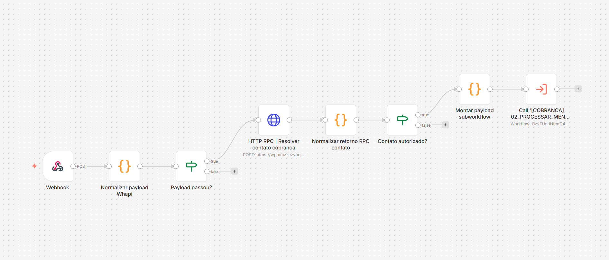

# Workflow 01 - Gateway WHAPI



## Visão geral

Este workflow é a camada de entrada da automação de cobrança.

Sua responsabilidade é receber eventos vindos da WHAPI, normalizar o payload do WhatsApp e decidir, com segurança, se a mensagem deve seguir para a esteira principal.

Ele funciona como um gateway operacional: filtra ruídos, bloqueia eventos fora do escopo e só encaminha mensagens associadas a contatos autorizados no Supabase.

## Objetivo

O objetivo do workflow 01 é proteger o restante da automação contra entradas inválidas.

Antes de qualquer classificação com IA, registro de resposta, análise de comprovante ou envio de cobrança, este fluxo confirma se a mensagem veio de uma conversa privada, se não foi enviada pelo próprio número, se não pertence a grupo e se o contato existe na base autorizada.

Essa etapa reduz processamento desnecessário e preserva a rastreabilidade do fluxo desde o primeiro evento.

## Papel na arquitetura

Dentro da arquitetura geral, este workflow é o ponto de controle entre o WhatsApp e o restante da solução.

Em vez de deixar que todo evento externo chegue diretamente aos workflows de processamento, ele centraliza a validação inicial e entrega ao workflow 02 um payload limpo, previsível e enriquecido com dados do contato.

## O que o workflow faz

### 1. Recebe o webhook da WHAPI

O fluxo começa no node `Webhook`, que recebe o payload enviado pela WHAPI sempre que uma mensagem chega ao número integrado.

Esse payload pode conter texto, áudio, imagem, documento ou outros metadados do evento.

### 2. Normaliza o payload recebido

O node `Normalizar payload Whapi` transforma diferentes formatos possíveis da WHAPI em uma estrutura única.

Nessa etapa são organizados campos como:

- identificador da mensagem;
- chat de origem;
- remetente normalizado;
- tipo da mensagem;
- corpo textual;
- metadados de mídia;
- nome do arquivo;
- MIME type;
- sinalização de mensagem própria;
- indicação de grupo ou conversa privada.

### 3. Bloqueia eventos fora do escopo

O node `Payload passou?` interrompe eventos que não devem seguir na automação.

Exemplos de bloqueio:

- mensagens enviadas pelo próprio número;
- mensagens de grupos;
- entradas que não são conversas privadas;
- PDFs que parecem ordem de serviço, evitando misturar o fluxo de cobrança com outro processo operacional.

### 4. Resolve o contato no Supabase

Quando o payload passa pela triagem inicial, o node `HTTP RPC | Resolver contato cobrança` consulta o Supabase para verificar se o número pertence a um contato ativo e autorizado.

RPC utilizada:

```text
public.n8n_cobranca_gateway_resolver_contato
```

Essa RPC retorna dados como cliente, contato, status de autorização e modo de teste.

### 5. Normaliza o retorno do banco

O node `Normalizar retorno RPC contato` transforma a resposta da RPC em um contrato padronizado para os próximos workflows.

Isso evita que o processamento posterior dependa diretamente do formato bruto da resposta HTTP.

### 6. Encaminha apenas contatos autorizados

O node `Contato autorizado?` decide se a mensagem pode seguir.

Se o contato for válido, o node `Montar payload subworkflow` prepara o pacote final e chama o workflow 02.

Se o contato não for válido, o fluxo termina sem acionar processamento adicional.

## Valor técnico demonstrado

Este workflow evidencia competências importantes em automação com n8n:

- desenho de gateway para eventos externos;
- normalização de payloads variáveis;
- controle de elegibilidade antes do processamento;
- integração entre n8n e Supabase via RPC;
- separação clara entre entrada, validação e processamento;
- proteção contra consumo desnecessário de IA e APIs externas.

## Resultado esperado

Ao final da execução, a automação tem uma decisão objetiva:

- mensagens válidas e autorizadas seguem para o workflow 02;
- mensagens inválidas são bloqueadas ainda na entrada.

Esse comportamento aumenta a confiabilidade do fluxo e mantém a esteira de cobrança focada apenas em contatos elegíveis.

## Export público

```text
workflows/sanitizados/01-gateway-whapi.sanitizado.json
```
