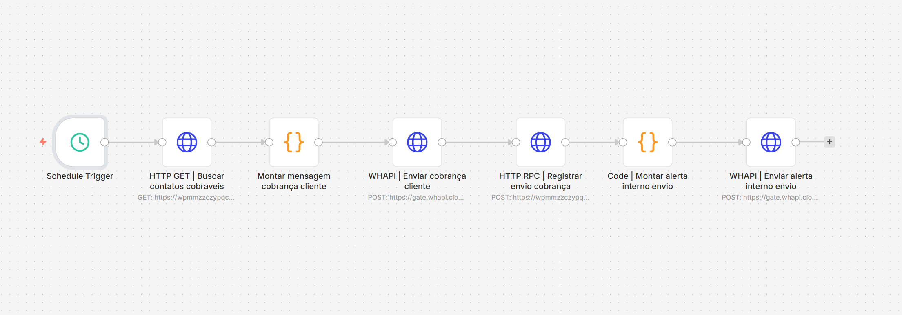

# Workflow 04 - Enviar Cobrança Clientes



## Visão geral

Este workflow executa o envio automático de cobranças para contatos elegíveis.

Ele consulta a fila operacional no Supabase, monta uma mensagem por template, envia a cobrança via WhatsApp e registra a auditoria do envio.

## Objetivo

O objetivo do workflow 04 é automatizar o contato ativo com clientes que possuem pendências vencidas e estão liberados para nova tentativa de cobrança.

O fluxo não decide sozinho quem deve ser cobrado. Essa decisão vem da camada de dados, por meio de uma view operacional que aplica regras de vencimento, status, pausa, quantidade de tentativas e próximo contato permitido.

## Papel na arquitetura

Este workflow representa a saída ativa da automação.

Enquanto o workflow 02 trata respostas recebidas e o workflow 03 avisa a equipe sobre entradas importantes, o workflow 04 cuida do disparo controlado de cobranças.

Essa divisão preserva uma responsabilidade clara: a base de dados define elegibilidade, e o n8n executa o envio e registra o resultado.

## O que o workflow faz

### 1. Executa em agenda recorrente

O node `Schedule Trigger` inicia a rotina em horários definidos.

Schedule demonstrativo:

```text
*/30 11-17 * * 1-5
```

Essa configuração representa uma execução a cada 30 minutos, dentro de uma janela comercial de segunda a sexta-feira.

### 2. Busca contatos cobráveis

O node `HTTP GET | Buscar contatos cobráveis` consulta a fila agrupada por contato.

View utilizada:

```text
public.n8n_cobranca_v_resumo_cobranca_contato
```

Essa view consolida pendências abertas e retorna apenas contatos aptos ao envio naquele momento.

### 3. Monta a mensagem de cobrança

O node `Montar mensagem cobrança cliente` cria a mensagem final enviada ao cliente.

A mensagem considera:

- nome do contato;
- nome do cliente;
- quantidade de pendências;
- valor total atualizado;
- vencimento mais antigo;
- tom de cobrança;
- instrução para envio de comprovante, caso o pagamento já tenha sido realizado.

Nos exemplos públicos, nomes reais foram substituídos por placeholders como:

```text
{{cliente}}
{{contato}}
```

### 4. Envia a cobrança via WhatsApp

O node `WHAPI | Enviar cobrança cliente` envia a mensagem para o contato normalizado.

O envio utiliza token configurado no ambiente, mas nenhum valor real é mantido no repositório público.

### 5. Registra o envio no Supabase

Após o envio, o node `HTTP RPC | Registrar envio cobrança` grava a auditoria do disparo.

RPC utilizada:

```text
public.n8n_cobranca_registrar_envio
```

Essa RPC registra o snapshot da cobrança, incrementa tentativas e calcula o próximo contato permitido.

### 6. Notifica a equipe sobre o envio

O node `Code | Montar alerta interno envio` cria uma mensagem resumida para auditoria interna.

Em seguida, o node `WHAPI | Enviar alerta interno envio` avisa a equipe que a cobrança foi disparada.

## Regras preservadas

- Agrupar múltiplas pendências do mesmo contato.
- Registrar snapshot das pendências no momento do envio.
- Incrementar tentativas de cobrança.
- Calcular próximo contato.
- Evitar reenvio imediato.
- Manter trilha de auditoria do disparo.

## Valor técnico demonstrado

Este workflow evidencia:

- envio ativo com controle de elegibilidade;
- uso de view como fila operacional;
- template determinístico para comunicação financeira;
- integração n8n, WHAPI e Supabase;
- auditoria de disparos;
- prevenção de duplicidade por regras de banco;
- separação entre decisão de dados e execução de mensageria.

## Resultado esperado

Ao final da execução, o cliente recebe uma cobrança consolidada e o Supabase registra exatamente o que foi enviado, para quem foi enviado e quais pendências estavam incluídas naquele momento.

Esse desenho permite acompanhar histórico, tentativas, respostas posteriores e próximas ações sem depender de conferência manual.

## Export público

```text
workflows/sanitizados/04-enviar-cobranca-clientes.sanitizado.json
```
